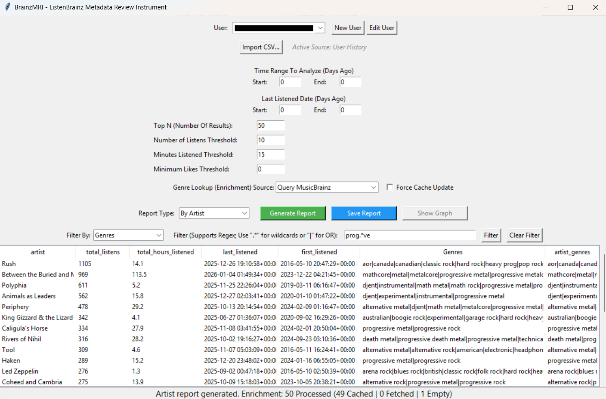
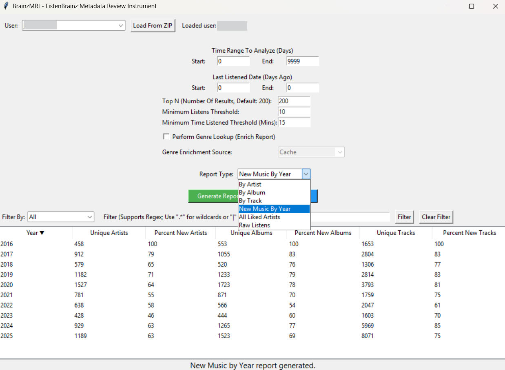

# BrainzMRI: ListenBrainz Metadata Review Instrument

A ListenBrainz "Metadata Review Instrument" (MRI) for analyzing listens from the ListenBrainz service.

BrainzMRI is a desktop tool for analyzing your **ListenBrainz** listening history.
It provides a **GUI application** for generating rich reports about your listening habits, including:

- Top artists, albums, and tracks
- **Time Range** filtering: Analyze listens across arbitrary time windows (by "days ago")
- **Last Played** filtering: Dig up "old favorites" or recent discoveries (by "days ago")
- **Likes-based filtering**: Filter artists, albums, and tracks by a minimum number of liked tracks (e.g., "Albums with 2+ likes")
- **Enhanced Genre Enrichment**: Enriches reports with genre data from **MusicBrainz** and **Last.fm**, using robust name-based fallback strategies when MBIDs are missing.
- **Observability**: Detailed status bar feedback on enrichment performance (cache hits, lookups, fallbacks).
- Fully sortable, filterable tables in the GUI (supports regex).
- Exportable CSV reports.

### GUI Application (`gui_main.py`)
- Load a zip file exported from your ListenBrainz account
- Filter your data by time range, last listened date, and thresholds
- Choose report type (Top Artists, Top Albums, New Music By Year, and more)
- Optionally enrich reports with genre data (MusicBrainz, Last.fm, or local cache)
- View results in a sortable, fully filterable table
- Save reports to disk as CSV (for opening/browsing elsewhere)
- Automatically remembers your last ZIP file and user settings (`config.json`)

### Launcher Script (`BrainzMRI.bat`)
- Simple menu to launch either:
  - GUI mode (starts by default)
  - Debug mode (available for tinkering)




---

## Attribution
This project was developed with assistance from **Microsoft Copilot** and **Google Gemini** as a fun test/experiment with "Vibe Coding".

---

# Installation

BrainzMRI requires **Python 3.10+** and a few common libraries.

### 1. Clone the repository
```bash
git clone [https://github.com/jasparagus/BrainzMRI.git](https://github.com/jasparagus/BrainzMRI.git)
cd BrainzMRI

```

### 2. Install dependencies

From inside the project directory:

```bash
pip install -r requirements.txt

```

---

# Running BrainzMRI

## Windows

Double-click:

```
BrainzMRI.bat

```

or run:

``` bash
python gui_main.py

```

## macOS / Linux

Run:

```bash
python3 gui_main.py

```

---

# Using the GUI

### 1. Select your ListenBrainz ZIP

Click **“New User”** or select an existing user to begin. If creating a new user, you can ingest a ListenBrainz export ZIP.

The app will automatically parse:

* listens
* feedback (likes/dislikes)
* metadata

### 2. Configure filters

You can set:

* **Time Range (days ago)**
Restrict listens to a specific window (by listened date). Applied at the listen level.
* **Last Listened (days ago)**
Filter by recency (based on when listens occurred). Applied at the entity level (artist/album/track) based on each entity’s true last listen.
* **Top N**
Limit the number of results.
* **Thresholds for Minimum Listens / Time Listened**
Apply thresholds to filter out low-activity artists, albums, tracks:
* Min. Listens Threshold (per entity)
* Minimum Time Listened Threshold (per entity, based on total duration)


* **Minimum Likes Threshold**
Filters entities by the number of unique liked tracks associated with them.
* Applies to Top‑N reports (Artist/Album/Track)
* Set to 0 to disable
* Example: Minimum Likes = 2 + By Album → albums with 2+ liked tracks


### 3. Configure enrichment (optional)

* **Perform Genre Lookup (Enrich Report)**
When checked, the report is enriched with genre information after all filtering and sorting.
* Supports **Tracks**, **Albums**, and **Artists**.
* **Name-Based Fallback**: If MusicBrainz IDs (MBIDs) are missing, the system automatically falls back to searching by name.
* **Observability**: The status bar will report how many items were cached vs. looked up.


* **Genre Enrichment Source**
* **Cache Only**: Uses only local genre cache (fastest, no network).
* **Query MusicBrainz**: Prioritizes MusicBrainz MBIDs, then falls back to name search.
* **Query Last.fm**: Uses Last.fm API (name-based).
* **Query All Sources (Slow)**: Tries MusicBrainz first, then Last.fm.


### 4. Choose a report type

From the dropdown:

* By Artist
* By Album
* By Track
* New Music by Year
* Raw Listens
* Note: shows all Raw Listens in selected time range


### 5. View results

Results appear in a sortable, filterable table:

* Click column headers to sort
* Use the filter bar to search (regex supported)
* Clear the filter to restore the full dataset

### 6. Save reports

Click **“Save Report”** to export:

* CSV reports (`.csv`) for all report types (with or without enrichment)
* Reports are saved to `.../cache/users/username/reports`

---

# Project Structure

```text
BrainzMRI/
│
├── BrainzMRI.bat                 # Windows launcher
├── gui_main.py                   # Main GUI entry point (tkinter)
├── gui_tableview.py              # Table rendering, filtering, sorting UI
├── gui_user_editor.py            # User creation and editing dialog
├── report_engine.py              # Pure report-generation logic & routing
├── reporting.py                  # Aggregation, grouping, and dynamic columns
├── enrichment.py                 # Genre/metadata enrichment logic (MB/Last.fm)
├── user.py                       # User cache utilities and helpers
├── parsing.py                    # Data parsing and canonicalization
│
├── LICENSE.txt
├── README.md
├── requirements.txt              # Required python modules
├── config.json                   # Auto-created settings file
└── cache/                        # Auto-created cache folder

```

---

# **Major Modules & Classes**

## `gui_main.py`: Main Application Orchestrator

Handles:

* Window creation, layout, and event wiring.
* User selection and ZIP ingestion coordination.
* Parsing all report parameters (thresholds, time ranges).
* Calling `ReportEngine.generate_report()`.
* Displaying detailed status messages (observability).

## `gui_tableview.py`: Table Visualization

Responsible for:

* Rendering DataFrames in a Tkinter Treeview.
* **Dynamic Column Handling**: Hides technical columns (MBIDs) while keeping them available in data.
* Regex-based filtering via a persistent filter bar.
* Clipboard copy of selected rows.

## `report_engine.py`: Central Report Routing

### Class: `ReportEngine`

Encapsulates:

* Time-range and Recency filtering.
* Dispatching to `reporting.py` functions.
* Orchestrating `enrichment.py`.
* **Status Generation**: Collects enrichment stats (hits/misses) and formats them for the GUI.

## `reporting.py`: Aggregation & Grouping

Implements report-level computations.

* **Dynamic Column Ordering**: Preserves MBIDs and other metadata at the end of the DataFrame to ensure enrichment works without cluttering the default view.
* `report_top()`: Handles Artist/Album/Track Top-N reports with thresholds.
* `report_new_music_by_year()`: Year-level unique-entity counts.

## `enrichment.py`: Metadata & Genre Enrichment

Handles metadata augmentation with robust fallbacks.

* **Multi-Provider**: Supports MusicBrainz and Last.fm.
* **Name-Based Fallback**: If MBID lookup fails, searches by Artist/Album/Track name.
* **Stats Collection**: Tracks cache hits, lookups, and fallbacks for user visibility.

## `user.py`: User Cache & Filesystem

Manages per-user storage and cached listen data.

* `User` class: Represents a user, their listens (DataFrame), and liked MBIDs.

---

# To-Do List

## Map Enter To "Generate Report"

* Pressing Enter key inside any of the filter boxes should trigger the "Generate Report" button.

## New Visualizations and Reports

* Stacked bar charts of top N artists/albums/tracks over time
* Use filtered data as the population
* Cap at ~20 entities for clarity
* Each entity receives a distinct color


* “Top New Artists/Albums/Tracks by Year”
* Add “Export Chart” option (PNG/SVG)

## Report Presets

* Dropdown presets for common report types:
* Forgotten Favorites
* All-Time Top 10
* Favorite New Discoveries
* Recently Neglected Artists


## Hybrid Mode (ListenBrainz + Last.fm APIs)

* Optional API ingestion for new listens.
* Merge ZIP + API data into a persistent local archive.
* UI controls for enabling/disabling ingestion.

## MusicBrainz Contribution Tools

* Log artists with missing genres + direct MusicBrainz URLs.
* Provide link to MusicBrainz metadata best-practices.
* UI viewer for missing-genre log.

## Multi-Source Ingestion & Fuzzy Deduplication

* Support ingestion from heterogeneous sources.
* Normalize entity names (fuzzy matching).
* Canonical entity resolver (resolve missing MBIDs).
* Probabilistic deduplication.

## Smarter Way To Address Multi-Artist Listens

* Currently, each artist on a listen (collaborations) is counted as a row.
* Investigate better grouping for per-album vs. per-artist reports.

## Missing-Genre Log Improvements

* Deduplicate entries in `missing_genres.txt`.
* Timestamp entries and provide cleanup mechanism.