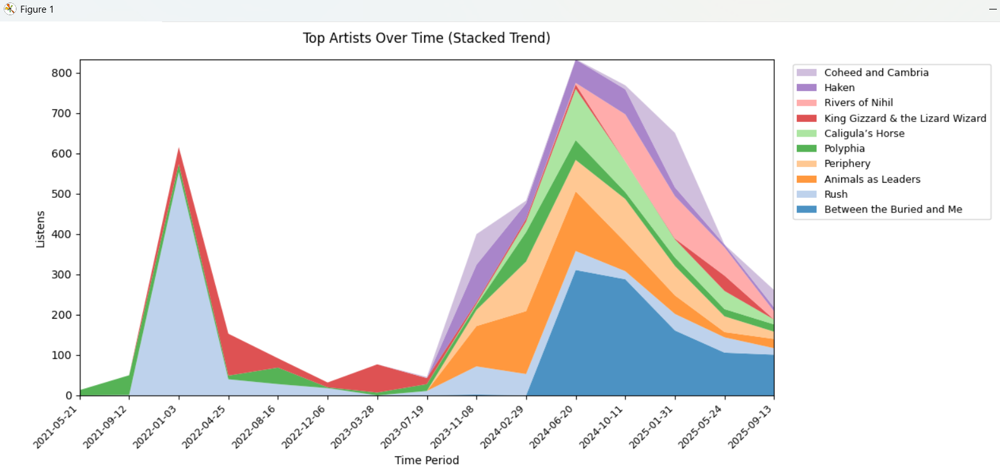

# BrainzMRI: ListenBrainz Metadata Review Instrument

**BrainzMRI** is a desktop "Metadata Review Instrument" (MRI) for analyzing your **ListenBrainz** listening history. It provides a local, privacy-focused GUI application for generating rich reports, enriching data with external metadata, and pushing actions back to the server.

Unlike standard "Year in Review" summaries, BrainzMRI works with a local cache of your data, allowing for instant filtering, complex queries, offline analysis, and bulk management of your collection.

## Key Features

### 1. Data Analysis & Reporting
* **User History:** Downloads and caches your entire ListenBrainz history (via ZIP export).
* **Report Types:**
    * **Top N:** By Artist, Album, or Track (filtered by date range, listen count, etc.).
    * **Genre Flavor:** Weighted analysis of your most-listened genres based on MusicBrainz and Last.fm tags.
    * **Favorite Artist Trends:** Time-series visualization of artist dominance over specific periods.
    * **New Music by Year:** Breakdown of discovery rates vs. recurring favorites.
    * **Raw Listens:** Deep dive into specific datasets with regex filtering.
* **Visualizations:** Interactive charts (Stacked Area, Stacked Bar) powered by Matplotlib.

### 2. External Data Ingestion
* **CSV Import:** Load arbitrary CSV playlists (e.g., from Spotify exports or other tools) to analyze them using BrainzMRI's matching engine.
* **Contextual Analysis:** Compare imported playlists against your personal listening history.

### 3. Metadata Enrichment
* **Genre Fetching:** Automatically queries MusicBrainz and Last.fm APIs to fetch tags for your top tracks.
* **Smart Caching:** Tags are cached locally (`user_cache/`) to minimize API traffic and provide instant results for subsequent reports.
* **Pipeline Stats:** Real-time feedback on enrichment performance (Cached vs. Fetched vs. Empty).

### 4. Upstream Actions (Read/Write)
* **Batch Likes:** Mark filtered lists of tracks as "Loved" on ListenBrainz in bulk.
* **Playlist Creation:** Export any generated report or filtered view directly to a ListenBrainz JSPF playlist.
* **Metadata Resolver:** Automatically query MusicBrainz to find missing IDs for generic CSV imports, upgrading "dumb" text lists into fully linkable, "Like"-able data.
* **Safety First:** Includes a **"Dry Run"** mode (on by default) to simulate API requests without modifying your account.
* **Data Hygiene:** Automatically scrubs tracks with poor metadata (missing MusicBrainz IDs) before uploading playlists to prevent API errors.

---

## Attribution
This project was developed with assistance from **Microsoft Copilot** and **Google Gemini** as a fun test/experiment with "Vibe Coding".

---

# Installation

BrainzMRI requires **Python 3.10+** and a few common libraries.

### 1. Clone the repository
```bash
git clone https://github.com/jasparagus/BrainzMRI.git "your/file/path/here/BrainzMRI"
cd BrainzMRI

```

### 2. Install dependencies

```bash
pip install -r requirements.txt

```

---

# Running BrainzMRI

## Windows

Double-click: `BrainzMRI.bat`

## macOS / Linux

Run:

```bash
python3 gui_main.py

```

---

# Usage Guide

1.  **Setup User:** Click "New User" (or "Edit User") to enter your ListenBrainz Username and User Token (found on your ListenBrainz settings page).
2.  **Generate Report:** Select a time range (e.g., enter "0, 365" for the last year) and a Report Type (e.g., "By Artist"). Click "Generate Report".
3.  **Filter:** Use the filter bar at the top of the table to search for specific artists or albums using Regex.
4.  **Actions:**
    * **Like Selected:** Highlight rows and click "Like Selected Tracks" to batch-like them on ListenBrainz.
    * **Resolve Metadata:** If your list has missing IDs (e.g., imported CSV), click "Resolve Metadata" to fetch them from MusicBrainz.
    * **Export Playlist:** Click "Export as Playlist" to turn your current view into a playlist on your profile.

---

# UI Examples





---

# Project Structure

```text
BrainzMRI/
│
├── BrainzMRI.bat                 # Windows launcher
├── gui_main.py                   # Main GUI orchestrator & Threading
├── gui_charts.py                 # Matplotlib visualization logic
├── gui_tableview.py              # Table rendering & Regex filtering
├── gui_user_editor.py            # User creation dialog
├── api_client.py                 # Network layer (MB/Last.fm/ListenBrainz)
├── report_engine.py              # Report routing & Pipeline logic
├── reporting.py                  # Math, Aggregation, & Data Prep
├── enrichment.py                 # Metadata fetching logic & Caching
├── user.py                       # Data Model & File I/O
├── parsing.py                    # JSON/CSV normalization
│
├── tests/                        # Unit tests
├── README.md
├── requirements.txt
└── config.json                   # Auto-created settings
```

---

# Master Roadmap

## Stability & Core Experience (Immediate)
* **[ ] Code Hygiene (Refactoring):**
    * *Goal:* Centralize data identity logic to prevent logic drift.
    * *Task:* Extract `generate_entity_key(artist, track, album)` into `parsing.py` and replace hardcoded key generation in `gui_main.py` and `enrichment.py`.

## Advanced Visualization
* **[ ] Heatmaps:**
    * *Goal:* Visualizations for listening density.
    * *Task:* Add a "Listening Clock" report (Radial or Matrix heatmap) showing `Hour of Day` vs `Day of Week`.
* **[ ] Survival Analysis:**
    * *Goal:* Visualize artist longevity.
    * *Task:* A 2D Histogram showing "First Listened Date" vs "Last Listened Date" to identify long-term favorites vs. short-term obsessions.

## Deep Analytics
* **[ ] Streak Detection:**
    * *Goal:* Identify "Binge Listening" sessions.
    * *Task:* Algorithm to find consecutive days/hours where a specific Artist or Album constituted >X% of listens.
* **[ ] "Forgotten Favorites" Engine:**
    * *Goal:* Intelligent recommendation.
    * *Task:* A specific report preset finding tracks that have: `High Play Count` + `High Like Score` + `Last Listened > 1 Year Ago`.

## Quality of Life
* **[ ] Report Presets:**
    * *Goal:* One-click configuration.
    * *Task:* A dropdown menu to pre-fill the Filter/Threshold inputs (e.g., "Deep Cuts", "Heavy Rotation", "Forgotten Favorites", "Love at First Sight").
* **[ ] Advanced Filtering:**
    * *Goal:* Power-user querying.
    * *Task:* Add specific inclusion/exclusion fields (e.g., "Artist DOES NOT match regex").
