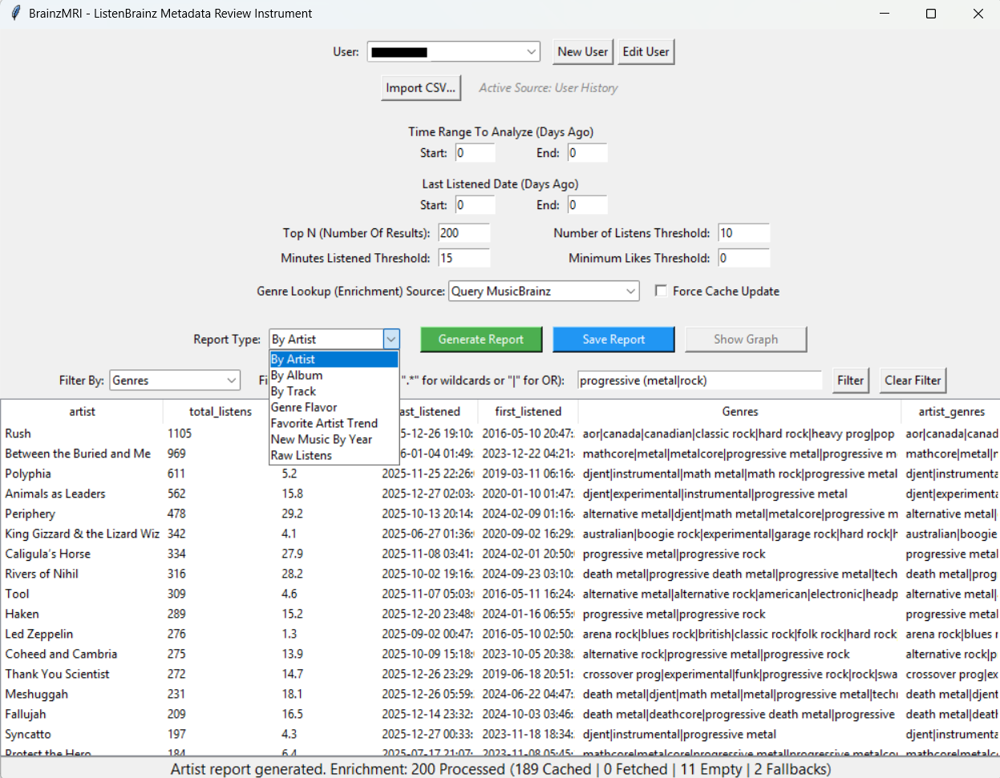
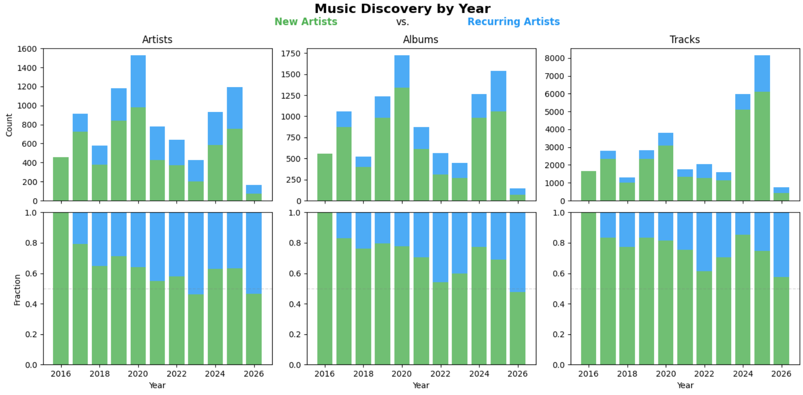

# BrainzMRI: ListenBrainz Metadata Review Instrument

**BrainzMRI** is a desktop "Metadata Review Instrument" (MRI) for analyzing your **ListenBrainz** listening history. It provides a local, privacy-focused GUI application for generating rich reports, enriching data with external metadata, and pushing actions back to the server.

Unlike standard "Year in Review" summaries, BrainzMRI works with a local cache of your data, allowing for instant filtering, complex queries, offline analysis, and bulk management of your collection.


## Gallery

| Main Interface | Artist Trends | New Music Discovery |
| :---: | :---: | :---: |
|  |  |  |

---

## Key Features

### Advanced Analysis & Reporting
* **Top N Reports:** Aggregate by **Artist**, **Album**, or **Track**.
    * **Filters:** Time Range (e.g., "Last 365 Days"), Recency (e.g., "Last Listened > 1 year ago"), and Activity Thresholds.
    * **Visual Indicators:** Tracks liked on ListenBrainz are marked with a ❤️.
* **Genre Flavor:** A weighted analysis of your listening habits. Unlike simple tag counts, this report weights genres by the *volume of listens*, giving a more accurate picture of your actual musical "diet."
* **Favorite Artist Trends:** A time-series analysis that bins your history (Daily/Weekly/Monthly) to show the rise and fall of your top artists over time.
* **New Music by Year:** A discovery analysis comparing "New Discoveries" (artists heard for the first time that year) vs. "Catalog" (re-listening to known artists).
* **Raw Listens:** A forensic view of your individual listen events, useful for verifying imports and data integrity.

### Rich Visualizations
* **Genre Treemap:** A rectangular visualization of genre dominance .
* **Stacked Area Chart:** Visualizes the "Favorite Artist Trend" report, showing how artist dominance shifts over periods. Now includes a subplot showing Relative Dominance (normalized percentage) alongside absolute listen counts.
* **Stacked Bar Chart:** Visualizes the "New Music by Year" report, highlighting your discovery rates over time. Now includes a subplot comparing the ratio of New vs. Recurring tracks.

### Metadata Enrichment & Deep Query
* **Smart Enrichment:** Automatically fetches metadata from MusicBrainz and Last.fm.
* **Deep Query Mode:** An optional "Slow" mode that fetches detailed metadata for Albums and Tracks, not just Artists.
* **Resolver Engine:** Can scan generic CSV imports (which lack IDs) and query MusicBrainz to resolve missing **Recording MBIDs**, upgrading "dumb" text lists into fully linkable, "Like"-able data.
* **"Æ" Sorting:** Custom sorting logic that handles special characters (e.g., normalizing "Æ" to "AE") so that artists sort intuitively rather than at the bottom of the list.

### Upstream Actions (Read/Write)
* **Batch Likes:** Highlight rows and mark them as "Loved" on ListenBrainz in bulk.
* **Playlist Creation:** Export any generated report or filtered view directly to a ListenBrainz JSPF playlist.
* **Safety First:** Includes a **"Dry Run"** mode (on by default) to simulate API requests without modifying your account.

### Robust Data Ingestion
* **Transactional Updates:** The "Get New Listens" feature uses a "Backwards Crawl" strategy with intermediate staging. This ensures that even if an update is aborted or crashes, your data remains consistent. It safely bridges the gap between your local history and the server without data corruption.
* **Resume Capability:** Interrupted downloads automatically save their progress to an "Island" cache and resume exactly where they left off.
* **CSV Import:** Load arbitrary CSV playlists (e.g., from Spotify exports) to analyze them using BrainzMRI's matching engine.

[UI EXAMPLES HERE]

---

## Attribution

This project was developed with assistance from **Microsoft Copilot** and **Google Gemini** as a fun test/experiment with "Vibe Coding".

---

# Installation

BrainzMRI requires **Python 3.10+** and a few common libraries.

### 1. Clone the repository
```bash
git clone https://github.com/jasparagus/BrainzMRI.git "your/file/path/here/BrainzMRI"
cd BrainzMRI

```

### 2. Install dependencies

```bash
pip install -r requirements.txt

```

---

# Running BrainzMRI

## Windows

Double-click: `BrainzMRI.bat`

## macOS / Linux

Run:

```bash
python3 gui_main.py

```

---

# Usage Guide

1. **Setup User:**
* Click "New User" (or "Edit User") to enter your ListenBrainz Username and User Token (found on your ListenBrainz settings page).
* If you have a previous ListenBrainz JSON export, you can ingest the ZIP file here to instantly populate your history.


2. **Fetch Data:**
* **Incremental Update:** Click **"Get New Listens"** to fetch recent tracks from the server. This process is safe to interrupt; it will resume from where it left off next time.
* **Import CSV:** Alternatively, click "Import CSV" to load an external playlist for analysis.


3. **Generate Report:**
* Select a **Report Type** (e.g., "Genre Flavor", "By Artist").
* **Time Filters:** Enter "0, 365" to analyze the last year.
* **Enrichment:** Select "Query MusicBrainz" to fetch genres. Check "Deep Query" if you need album-level precision (slower).
* Click **"Generate Report"**.


4. **Visualize:**
* For supported reports (Artist Trend, Genre Flavor, New Music), click **"Show Graph"** to open a Matplotlib visualization window.


5. **Refine & Act:**
* **Filter:** Use the Regex filter bar to drill down (e.g., `Rock|Metal` to find matches for either).
* **Resolve:** If data is missing IDs (common with CSV imports), click **"Resolve Metadata"** to query MusicBrainz.
* **Action:** Highlight tracks and click **"Like Selected Tracks"** or **"Export as Playlist"** to push changes back to ListenBrainz.


---

# Project Structure

```text
BrainzMRI/
│
├── BrainzMRI.bat                 # Windows launcher
├── gui_main.py                   # Main Orchestrator: Threading, Updates, & Workflow
├── gui_charts.py                 # Matplotlib Logic: Treemaps, Stacked Area/Bar Charts
├── gui_tableview.py              # Table Logic: Rendering, Regex Filter, & "Æ" Sorting
├── gui_user_editor.py            # User Profile Management & ZIP Ingestion
├── api_client.py                 # Network Layer: Retries, Rate Limiting (MB/Last.fm/LB)
├── report_engine.py              # Report Routing & Status Management
├── reporting.py                  # Core Logic: Aggregation, Statistics, & Pandas operations
├── enrichment.py                 # Metadata Logic: Caching, Fetching, & MBID Resolution
├── user.py                       # Persistence: Data I/O, Deduplication, & Intermediate Cache
├── parsing.py                    # Utilities: Key Generation, Normalization, & File Parsing
│
├── tests/                        # Unit tests
├── README.md
├── requirements.txt
└── config.json                   # Auto-created settings

```

---

# Master Roadmap

### **[ ] Data Integrity: Auto-Refresh Likes**

* **Goal:** Ensure the local "Loved Tracks" cache is always synchronized with the server whenever new history is fetched.
* **Workflow:**
1. User clicks **"Get New Listens"**.
2. **Parallel Action:** In addition to the "Backwards Crawl" for new listens, the system triggers a request to the ListenBrainz/MusicBrainz API to fetch the latest `user_likes` (JSON).
3. **Merge:** The application parses the fresh likes data and updates the local "Master Likes List" (stored in `user.json` or `config.json`), adding new likes and potentially removing un-liked ones if full synchronization is desired.
4. **UI Update:** The UI (specifically the "Liked" column in reports) instantly reflects these new likes without requiring a restart.

* **Benefit:** Prevents the "stale likes" problem where a track liked on the website yesterday doesn't show up as loved in BrainzMRI today, ensuring accurate "Favorite" reporting.


### **[ ] Playlist Prep: Album Expansion Engine**

* **Goal:** Enable the creation of "Full Album" playlists from album-level reports (e.g., turning a "Top Albums of 2024" report into a playable track list).
* **Workflow:**
1. User generates a **"By Album"** report (applying standard filters like time range, play count, etc.).
2. A new button, **"Show All Tracks for Listed Albums"**, appears in the UI.
3. **Expansion Logic:**
* **Fetch:** The system iterates through the `release_mbid`s in the current report and queries the MusicBrainz API to retrieve the full official tracklist for each release.
* **Merge Stats:** It creates a new "Expanded Report" DataFrame containing every track from these albums. It then left-joins the user's local statistics (e.g., `total_listens`, `last_listened`, `Liked` status) onto these tracks.
* **Enrich:** Genre metadata is applied to each track (sourced from Cache or API based on the current "Genre Lookup" setting).
4. **Render:** The UI table refreshes to display this new "Expanded Track List."

* **Benefit:** This transforms abstract album statistics into actionable track lists, allowing users to immediately utilize the existing "Export to Playlist" or "Batch Like" features on full albums.


### **[ ] Heatmaps:**
* *Goal:* Visualizations for listening density (Hour of Day vs Day of Week).


### **[ ] Streak Detection:**
* *Goal:* Identify "Binge Listening" sessions (consecutive days/hours of specific artists).


### **[ ] Report Presets:**
* *Goal:* Dropdown menu to pre-fill complex filter configurations.
 * Example: "Forgotten Favorites" (`High Play Count` + `Last Listened > 1 Year Ago`).
 * Example: "All Time Greatest Albums" (`High Play Count` + `High Play Count` + `4+ Likes Per Album`).


### **[ ] Advanced Filtering:**
* *Goal:* "Negative" filtering (e.g., "Artist DOES NOT match regex").


# Implementation Strategy For Next Item

### **[ ] Data Integrity: Auto-Refresh Likes**

Here is the proposed implementation strategy to deliver this feature while maintaining the application's stability and thread safety.

### Strategy: "Data Integrity: Auto-Refresh Likes"

This feature requires changes across three layers of the application to ensuring that the "Like" synchronization happens concurrently with the "Listen" download, without causing write conflicts on the user's cache files.

#### **Phase 1: Network Layer (`api_client.py`)**

We need a method to fetch the "Likes" from the API. Unlike listens, likes are stateless (they don't have timestamps we use for sync), so we must fetch the current snapshot.

* **New Method:** `get_user_likes(username, offset, count)`
* **Endpoint:** `GET https://api.listenbrainz.org/1/user/{username}/likes`
* **Logic:** The API returns likes in pages. We will need a loop to fetch *all* likes to ensure we catch everything (and correctly identify un-likes). We should request large batches (e.g., 500 or 1000 at a time) to minimize overhead.

#### **Phase 2: Persistence Layer (`user.py`)**

We need a thread-safe way to update the user's `liked_mbids` set.

* **New Method:** `sync_likes(new_mbids: set)`
* This method will *replace* the internal `self.liked_mbids` with the new set provided by the API. This ensures that tracks you have "un-liked" on the server are removed from your local cache.


* **Constraint:** Since we will have two threads potentially trying to save data (the "New Listens" crawler and the "Likes" fetcher), we must ensure `save_cache()` does not corrupt the JSON files.
* **Architecture Decision:** We will introduce a `threading.Lock` inside the `User` class to serialize access to `save_cache()`.


#### **Phase 3: Orchestration (`gui_main.py`)**

This is where the "Parallel Action" logic lives. We will modify `action_get_new_listens` to spawn a second worker thread.

* **Modification to `action_get_new_listens`:**
1. **Main Worker (Existing):** Continues to crawl "Backwards" for new listens and stages them in `intermediate_listens.jsonl`.
2. **Likes Worker (New):**
* Starts immediately alongside the Main Worker.
* Loops through the `api_client.get_user_likes` pages until all likes are retrieved.
* Collects them into a single `set`.
* Calls `user.sync_likes(new_set)` -> `user.save_cache()`.
* Updates the Status Bar (e.g., "Likes Synced: 1420 tracks").


3. **Synchronization:** The two threads operate independently. The `threading.Lock` in `user.py` ensures they don't crash the file writer if they finish at the exact same moment.


### Execution Plan

1. **Update `api_client.py`:** Implement the `get_user_likes` wrapper.
2. **Update `user.py`:** Add `sync_likes` and the write lock.
3. **Update `gui_main.py`:** Implement the `fetch_likes_worker` inside the update action.

**Shall I proceed with generating the code for Phase 1 (`api_client.py`)?**