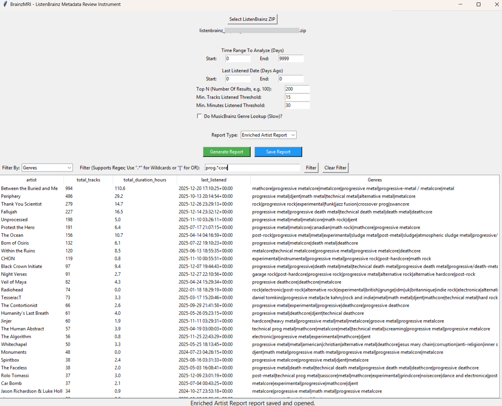

# BrainzMRI: ListenBrainz Metadata Review Instrument
A ListenBrainz "Metadata Review Instrument" (MRI) for analyzing listens from the ListenBrainz service.

BrainzMRI is a desktop tool for analyzing your **ListenBrainz** listening history.  
It provides a **GUI application** for generating rich reports about your listening habits, including:

- Top artists, albums, and tracks  
- "Time Range" filter for listens enables looking across arbitrary time windows (by "days ago")
- "Last Played" filter enables digging up "old favorites" and more (by "days ago")
- Liked-artist reports (list of artists whom you have liked)
- Optional genre enrichment with **MusicBrainz genre lookups**
- Fully sortable, filterable tables in the GUI (using regex)
- Exportable CSV reports  

## Attribution
This project was developed with assistance from Microsoft Copilot as a fun test of "Vibe Coding".

---

## **Features**


### GUI Application (BrainzMRI_GUI.py)
- Load a ListenBrainz export ZIP  
- Configure:
  - Time Range (as a window; days ago)
  - Last-listened Range (as a window; days ago)
  - Minimum listens / minutes thresholds
  - Top-N limits  
- Choose report type:
  - By Artist  
  - By Album  
  - By Track  
  - All Liked Artists  
- Optionally enrich any report with MusicBrainz genre data  
- View results in a sortable, fully filterable table  
- Save reports to disk as CSV  
- Automatically remembers your last ZIP file  
- Stores configuration info in a `config.json` file

### Launcher Script (BrainzMRI.bat)
- Simple menu to launch either:
  - GUI mode
  - Debug mode

---

# Installation

BrainzMRI requires **Python 3.10+** and a few common libraries.

### 1. Clone the repository
```bash
git clone https://github.com/jasparagus/BrainzMRI.git
cd BrainzMRI
```

### 2. Install dependencies
From inside the project directory:

```bash
pip install -r requirements.txt
```

If you don’t have a `requirements.txt`, install manually:

```bash
pip install pandas tqdm
```

*(Tkinter is included with most Python installations.)*

---

# Running BrainzMRI

## Windows
Double-click:

```
BrainzMRI.bat
```

or run:

```bash
python BrainzMRI_GUI.py
```

## macOS / Linux
Run:

```bash
python3 BrainzMRI_GUI.py
```

---

# Using the GUI

### 1. Select your ListenBrainz ZIP
Click **“Select ListenBrainz ZIP”** and choose the export file downloaded from ListenBrainz.

The app will automatically parse:
- listens  
- feedback (likes/dislikes)  
- metadata  

### 2. Configure filters
You can set:

- **Time Range (days ago)**  
  Restrict listens to a specific window (by listened date).

- **Last Listened (days ago)**  
  Filter by recency (based on when listens occurred).

- **Top N**  
  Limit the number of results.

- **Minimum Listens / Minutes**  
  Apply thresholds to filter out low-activity artists, albums, tracks, or liked artists:
  - Min. Listens Threshold (per entity)
  - Min. Minutes Listened Threshold (per entity, based on total duration)

### 3. Configure enrichment (optional)
- **Perform Genre Lookup (Enrich Report)**  
  When checked, the report is enriched with genre information after all filtering and sorting.

  Tooltip:
  > Add genre information to the report using MusicBrainz.  
  > Runs after all filters and sorting.  
  > May be slow if API lookup is enabled.

- **Genre Enrichment Source**  
  - **Cache** — use only the local genre cache  
  - **Query API (Slow)** — query MusicBrainz and update the cache (subject to rate limiting)  
  - Enabled only when enrichment is turned on

### 4. Choose a report type
From the dropdown:

- **By Artist**
  - Note: collaborating artists are counted separately
- **By Album**  
- **By Track**  
- **All Liked Artists**  

### 5. View results
Results appear in a sortable, filterable table:

- Click column headers to sort  
- Use the filter bar to search (regex supported)  
- Clear the filter to restore the full dataset  

### 6. Save reports
Click **“Save Report”** to export:

- CSV reports (`.csv`) for all report types (with or without enrichment)  

Reports are saved in a `reports/` folder next to your ZIP file.

---

# Project Structure

```text
BrainzMRI/
│
├── BrainzMRI.bat           # Windows launcher
├── BrainzMRI_GUI.py        # GUI application
├── LICENSE.txt             # License (GNU GPL)
├── ParseListens.py         # Core parser and report logic
├── README.md               # This file
├── example.png             # Example of GUI
├── requirements.txt        # Required Python modules
├── reports/                # Auto-created report output folder
└── config.json             # Auto-created settings file
```

# TODO (Items for Future Improvements)

## UI Improvements
- Abstract repeated UI patterns (Frame + Label + Entry)
- Break show_table() into helper functions:
  - build_filter_bar()
  - build_table_container()
  - populate_table()
- Break run_report() into:
  - parse_time_range()
  - parse_thresholds()
  - generate_report()
  - apply_enrichment()
  - finalize_report()
## Enrichment Enhancements
- Add album-level enrichment using release MBIDs
- Add track-level enrichment using recording MBIDs
- Expand genre cache to store and merge multiple entries per entity
- Add a “missing genre” log with MusicBrainz URLs for manual tagging
## Hybrid Mode (ListenBrainz + Last.fm APIs for Data)
- Add optional API ingestion for new listens
- Merge ZIP + API data into a persistent local archive
- Deduplicate listens using MBIDs + timestamps
- Add UI controls for enabling/disabling ingestion
- Add “Sync New Listens” button
## Visualization Features
- Add stacked bar charts for top artists/albums/tracks over time
- Limit to Top N (max 20)
- Use matplotlib or seaborn
- Add “Export Chart” option
## MusicBrainz Contribution
- Enable a log of Artists (and URLs) for whom enrichment fails (e.g. "Unknown")
- Generate a URL to visit at MusicBrainz for each artist in said list
- Provide a link to MusicBrainz best practices for metadata contribution
- Build a minimal UI popout for linking to Metadata editing
## New Visualizations
- Build a graph of favorite N artists/albums/tracks vs. time as a stacked bar plot from the data
- Should use TopN as the population to track, but should be capped at 20
- Plot should show the top N artists/albums/tracks as a function of time
- Plot should be a set of stacked bars, showing favorite(s) vs. time
- Each artist/album/track should have its own color