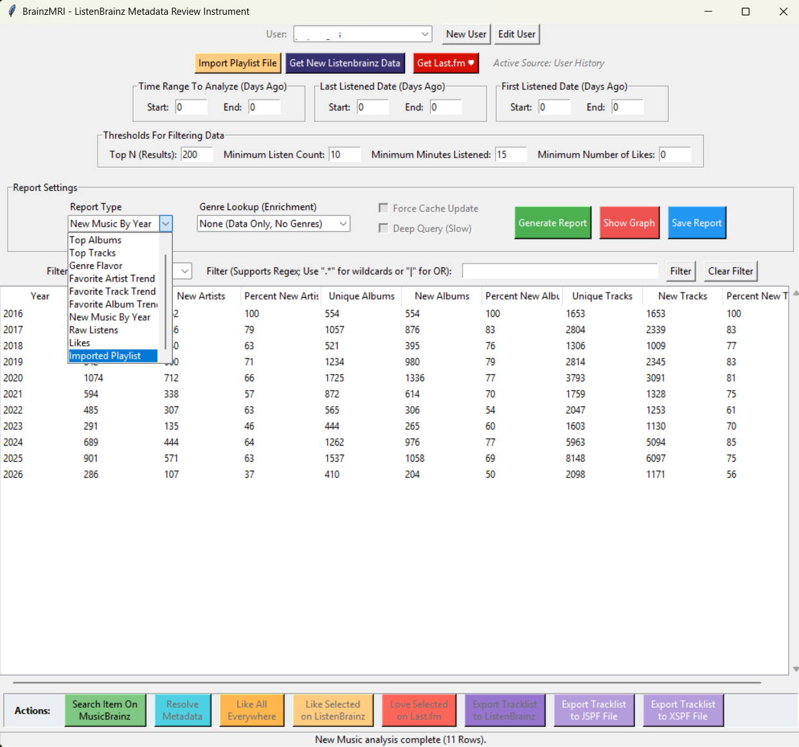

# BrainzMRI: ListenBrainz Metadata Review Instrument

**BrainzMRI** is a desktop "Metadata Review Instrument" (MRI) for analyzing your **ListenBrainz** listening history. It provides a local, privacy-focused GUI application for generating rich reports, enriching data with external metadata, and pushing actions back to the server.

Unlike standard "Year in Review" summaries, BrainzMRI works with a local cache of your data, allowing for instant filtering, complex queries, offline analysis, and bulk management of your collection.


## Gallery

| Main Interface | Artist Trends | New Music Discovery | Genre Flavor |
| :---: | :---: | :---: | :---: |
|  |  |  |  |

---

## Key Features

### Advanced Analysis & Reporting

* **Top N Reports:** Aggregate by **Artist**, **Album**, or **Track**.
    * **Filters:** Time Range (e.g., "Last 365 Days"), Recency (e.g., "Last Listened > 1 year ago"), and Activity Thresholds.
    * **Metrics:** View total listen counts and **Like counts** for every entity.
* **Genre Flavor:** A weighted analysis of your listening habits. Unlike simple tag counts, this report weights genres by the *volume of listens* and *likes*, giving a more accurate picture of your actual musical "diet."
* **Genre Flavor Treemap:** A rectangular visualization of genre dominance, displaying both listen counts and **Like counts (❤️)** in the labels. Uses the same data as the **Genre Flavor** report.
* **Favorite Trends:** A time-series analysis that bins your history (Daily/Weekly/Monthly) to show the rise and fall of your top **Artists**, **Tracks**, or **Albums** over time.
* **New Music by Year:** A discovery analysis comparing "New Discoveries" (artists heard for the first time that year) vs. "Catalog" (re-listening to known artists).
* **Raw Listens:** A forensic view of your individual listen events, useful for verifying imports and data integrity.
* **Likes Audit:** A cross-platform comparison of your liked/loved tracks on both **ListenBrainz** and **Last.fm**. Shows `Last.fm Liked`, `ListenBrainz Liked`, and `Both Liked` status per track, with full MBID visibility for sorting and filtering.

### Rich Visualizations
* **Album Art Matrix:** A grid visualization of album covers for "Top Albums" reports, fetching thumbnails from the **Cover Art Archive** and caching them locally. Uses a **release-group fallback** — if a specific release has no artwork, it automatically looks up the parent release group to find art from any pressing of the same album.
* **Genre Treemap:** A rectangular visualization of genre dominance .
* **Stacked Area Chart:** Visualizes the "Favorite Trend" reports (Artist, Track, or Album), showing how entity dominance shifts over periods. Includes a subplot showing Relative Dominance (normalized percentage) alongside absolute listen counts.
* **Stacked Bar Chart:** Visualizes the "New Music by Year" report, highlighting your discovery rates over time. Now includes a subplot comparing the ratio of New vs. Recurring tracks.

### Metadata Enrichment & Deep Query
* **Smart Enrichment:** Automatically fetches metadata from MusicBrainz and Last.fm.
* **Deep Query Mode:** An optional "Slow" mode that fetches detailed metadata for Albums and Tracks, not just Artists.
* **Resolver Engine:** Can scan generic playlist imports (which lack IDs) and query MusicBrainz to resolve missing **Recording MBIDs**, upgrading "dumb" text lists into fully linkable, "Like"-able data. The resolver shows a rolling progress log with per-item **✓/✗** status and running success/failure counts.
* **Genre Exclusion:** Configurable `excluded_genres` list in `config.json` filters junk genres (e.g., "seen live") at display-time without modifying cached data.
* **Enrichment Failure Diagnostics:** Failed lookups are logged to `enrichment_failures.jsonl` for identifying missing MusicBrainz metadata.
* **"Æ" Sorting:** Custom sorting logic that handles special characters (e.g., normalizing "Æ" to "AE") so that artists sort intuitively rather than at the bottom of the list.

### Upstream Actions (Read/Write)
* **Batch Likes (Multi-Service):**
    * **Like All Everywhere:** Push all tracks with valid MBIDs to both ListenBrainz and Last.fm in one action.
    * **Like Selected (ListenBrainz):** Highlight rows and mark them as "Loved" on ListenBrainz.
    * **Like Selected (Last.fm):** Highlight rows and love them on Last.fm using the authenticated session.
* **Get Last.fm ♥:** Fetch your loved tracks from Last.fm and cache them locally. Automatically switches to the **Likes** audit report.
* **Playlist Export:** Export any generated report or filtered view directly to a **ListenBrainz playlist**, or save locally as **JSPF** or **XSPF** files.
* **Safety First:** Includes a **"Dry Run"** mode (on by default) to simulate API requests without modifying your account.

### Robust Data Ingestion
* **Transactional Updates:** The "Get New Listens" feature uses a "Backwards Crawl" strategy with intermediate staging. This ensures that even if an update is aborted or crashes, your data remains consistent. It safely bridges the gap between your local history and the server without data corruption.
* **Resume Capability:** Interrupted downloads automatically save their progress to an "Island" cache and resume exactly where they left off.
* **Playlist Import:** Load playlists in **CSV**, **JSPF**, **XSPF**, or **TXT** formats (e.g., from Spotify or YouTube Music exports) to analyze them using BrainzMRI's matching engine.

---

## Attribution

This project was developed with assistance from **Microsoft Copilot** and **Google Gemini** as a fun test/experiment with "Vibe Coding".

---

# Installation

BrainzMRI requires **Python 3.10+** and a few common libraries.

### 1. Clone the repository
```bash
git clone https://github.com/jasparagus/BrainzMRI.git "your/file/path/here/BrainzMRI"
cd BrainzMRI

```

### 2. Install dependencies

```bash
pip install -r requirements.txt

```

---

# Running BrainzMRI

## Windows

Double-click: `BrainzMRI.bat`

## macOS / Linux

Run:

```bash
python gui_main.py

```

---

# Usage Guide

1. **Setup User:**
* Click "New User" (or "Edit User") to enter your ListenBrainz Username and User Token (found on your ListenBrainz settings page).
* If you have a previous ListenBrainz JSON export, you can ingest the ZIP file here to instantly populate your history.


2. **Fetch Data:**
* **Incremental Update:** Click **"Get New Listens"** to fetch recent tracks from the server. This process is safe to interrupt; it will resume from where it left off next time.
* **Import Playlist:** Click **"Import Playlist File"** to load an external playlist (CSV, JSPF, XSPF, or TXT).
    * *Note:* This enables a special **"Imported Playlist"** report mode. It does *not* merge with your persistent history. You can switch between "Imported Playlist" and your main "Top Artists" reports at any time.


3. **Generate Report:**
* Select a **Report Type** (e.g., "Genre Flavor", "Top Artists").
* **Time Filters:** Enter "0, 365" to analyze the last year.
* **Enrichment:** Select "Query MusicBrainz" to fetch genres. Check "Force Cache Update" to retry previously failed lookups. Check "Deep Query" if you need album- or track-level precision (slower).
* Click **"Generate Report"**.
    * *Note:* Standard reports (Top Artists, Trends) always utilize your full User History. To view your imported playlist data, explicitly select **"Imported Playlist"** from the dropdown.


4. **Visualize:**
* For supported reports (Artist/Track/Album Trend, Genre Flavor, New Music, Top Albums), click **"Show Graph"** to open a stable, embedded matplotlib visualization window. For **Top Albums**, this displays an Album Art Matrix with cover art fetched from the Cover Art Archive.


5. **Refine & Act:**
* **Filter:** Use the Regex filter bar to drill down (e.g., `Rock|Metal` to find matches for either).
* **Resolve:** If data is missing IDs (common with CSV imports or the Likes report), click **"Resolve Metadata"** to query MusicBrainz. A rolling log shows per-item success/failure.
* **Action:** Highlight tracks and click **"Like Selected (ListenBrainz)"**, **"Like Selected (Last.fm)"**, or **"Like All Everywhere"** to push likes. Use **"Export as Playlist"** to export to ListenBrainz, JSPF, or XSPF.


---

# Project Structure

```text
BrainzMRI/
│
├── BrainzMRI.bat                 # Windows launcher
├── gui_main.py                   # View: Root Window, Event Loop, & Component Assembly
├── gui_header.py                 # View: User Selection, Source Management, & Session State
├── gui_filters.py                # View: Report Inputs, Thresholds, & Validation
├── gui_actions.py                # View: Upstream Actions (Likes, Playlist, Resolve)
├── gui_tableview.py              # View: Data Grid, Sorting, & Regex Filtering
├── gui_charts.py                 # View: Matplotlib Visualization Logic
├── gui_user_editor.py            # View: User Creation & ZIP Ingestion Dialog
│
├── report_engine.py              # Controller: Aggregation Pipeline & Data Routing
├── sync_engine.py                # Controller: Background Synchronization & Concurrency
├── likes_sync.py                 # Controller: Lightweight Last.fm Loves Fetch & Cache
│
├── reporting.py                  # Model: Core Aggregation, Statistics, & Filtering Logic
├── enrichment.py                 # Model: Metadata Fetching, Caching, & Resolution
├── user.py                       # Model: Data Persistence, File I/O, & Thread Locking
├── api_client.py                 # Network: HTTP Client, Retries, Rate Limiting, & Cover Art Archive
├── parsing.py                    # Utility: File Parsing, Normalization, & Key Generation
├── config.py                     # Utility: Global Configuration & Constants
│
├── README.md
├── requirements.txt
├── config.json                   # Auto-created settings
│
└── cache/global/                   # Persistent caches
    ├── artist_enrichment.json      # Genre tags per artist
    ├── mbid_resolver_cache.json    # (Artist, Track, Album) → MBID mappings
    ├── release_group_map.json      # release_mbid → release_group_mbid mappings
    ├── enrichment_failures.jsonl   # Failed lookup diagnostics
    └── cover_art/                  # Cached album cover thumbnails (.jpg)
```

---

# Roadmap

## Enter The Matrix 
- Replace the current "Album Art Matrix" feature (hidden in "Show Graph" for "Top Albums") with a dedicated "Show Art Matrix" button (located next to "Show Graph"). This will be a new type of analysis (in addition to "Show Graph" and "Save Report") that will be available whenever possible (i.e. for regular reports, playlists, etc.). It will enable visualizing entities in a pleasing (album-art-focused) way. When clicked, "Show Art Matrix" will:
- Operate on the data in the current table (so it will respect any filters applied to the data)
- Choose what entity to visualize based on the current columns:
  - For albums, the current behavior is preserved (that is, it should visualize albums), with the slight modification that filters should be applied
  - For Artists and Tracks, it should visualize a sub-matrix of album art (in a square block) for each artist and album in the data
- In all cases, the visualized matrix should be annotated in the same manner as the current "Album Art Matrix" (with the same content and font). That is:
  - for artists and tracks, the overall sub-matrix will be tagged with the artist name, total listens, and total likes by artist.
  - for albums, the current annotation should be identical in format and content to the current "Album Art Matrix", except that it will reflect any applied filters


## Relative Time for Filter
* Enable time selection with a few presets, such as ("Last Month", "Last Year", 20XX, etc., which will auto-populate the "days ago" or "last listened" filters). Will need to decide on a basic UI (dropdown?) which, when selected, will auto-populate the associated filter(s) relative to the current datetime.

## Heatmaps
* Goal: Visualizations for listening density (Hour of Day vs Day of Week).

## Listen Deletion
* Goal: Allow users to delete individual listens from their **ListenBrainz** and/or **Last.fm** history directly from the "Raw Listens" view.
* Workflow: User selects rows in the Raw Listens table, clicks a "Delete Selected" button, confirms via dialog, and the selected listens are removed from the remote service(s) via API.

## Streak Detection
* Goal: Identify "Binge Listening" sessions for a specific artists, albums, or tracks, in which the user listened to multiple tracks from the same artist, album, or track in a short period of time (consecutive days/hours of specific artists, albums, or tracks above some automatic threshold using a simple statistical method to identify outliers).
* Workflow: add a new report type for "Binge Listens" that plots a graph of all 3 types of listens (artist, album, and track) and highlights the outliers as a function of time (within the filtered dataset) using the standard filters.


## Group Artists, Albums
* Goal: reduce clutter from near-identical versions of similar (related) tracks and albums, such as deluxe or remasters.
* Workflow: add a checkbox "Group Similar Albums, Artists, and Tracks" (or similar) that will group each artist, album (release), and track by its parent (higher-level, per MusicBrainz) mbid so that variants of the same artist, album, and/or track are grouped together. This will not modify the raw listen data, but should impact all reports for aggregation purposes. 


## Playlist Prep: Album Expansion Engine
* Goal: Enable the creation of "Full Album" playlists from album-level reports (e.g., turning a "Top Albums of 2024" report into a playable track list).
* Workflow:
1. User generates a **"By Album"** report (applying standard filters like time range, play count, etc.).
2. A new button, **"Show All Tracks for Listed Albums"**, appears in the UI.
3. Expansion Logic:
* **Fetch:** The system iterates through the `release_mbid`s in the current report and queries the MusicBrainz API to retrieve the full official tracklist for each release.
* **Merge Stats:** It creates a new "Expanded Report" DataFrame containing every track from these albums. It then left-joins the user's local statistics (e.g., `total_listens`, `last_listened`, `Liked` status) onto these tracks.
* **Enrich:** Genre metadata is applied to each track (sourced from Cache or API based on the current "Genre Lookup" setting).
4. **Render:** The UI table refreshes to display this new "Expanded Track List."

* **Benefit:** This transforms abstract album statistics into actionable track lists, allowing users to immediately utilize the existing "Export to Playlist" or "Batch Like" features on full albums.

## Re-Evaluate Thresholds (duration)
* The "duration" filter relies on poor quality track duration data, which is often missing or wrong. It is helpful to treat long tracks with appropriate weight, but is not particularly robust otherwise. Consider ways to effectively use it. Maybe add a duration cache per mbid?

## Miscellaneous Improvements and Fixes
* Decide if a small bit of padding should be added at the top of the app UI to avoid clipping with the menu bar
* Rename "Show Graph" to "Show Visualization" (two lines)
* Rename track_name -> Track (in Raw Listens view)
* Resolver Change: need to allow resolver to find Artist/Album/Track for items with an existing mbid but a missing title/artist/track info. This should help with likes sync to make the list richer. This is currently broken despite the rest of the feature working well.